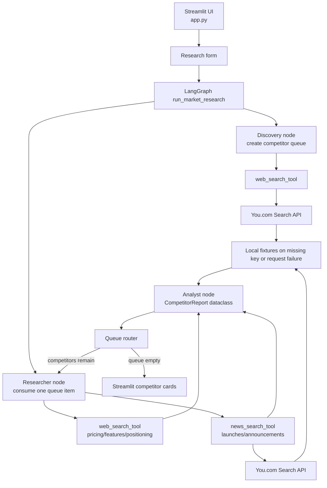

# Market research agent

A Streamlit application built around a cyclic LangGraph orchestrator. It discovers up to three competitors, researches each competitor one at a time, and renders source-backed competitor reports. The app uses You.com Search and News when `YOUCOM_API_KEY` is configured and deterministic local fixtures when it is not.

The current build is intentionally review-oriented: it surfaces evidence, pricing signals, positioning, features, news, sources, and confidence. It does not make business decisions or persist user data.

## Architecture



## Runtime flow

1. The user enters a company or product name in the Streamlit form.
2. `run_market_research()` validates the name and invokes `LangGraphMarketResearchFlow`.
3. The discovery node searches for five candidate results and keeps the first three in `competitor_queue`.
4. The researcher node pops one competitor and calls the web and news tools.
5. Each candidate receives separate web and news searches.
6. The analyst node converts that evidence into one `CompetitorReport` dataclass and appends it to `final_reports`.
7. Streamlit renders confidence, summary, positioning, features, pricing, recent news, and source links.
8. The UI displays graph events and stores the latest result in session state.

## Project layout

```text
MARKET_RESEARCH_AGENT/
├── app.py                 # Streamlit entrypoint and report-card UI
├── youcom_client.py       # You.com client and local fallback fixtures
├── youcom_tools.py        # LangChain-compatible tools and legacy workflow API
├── schemas.py             # Dataclass contracts, including CompetitorReport
├── security.py            # Input validation and text sanitization
├── langgraph_workflow.py  # Discovery/research/analyst graph and queue router
├── graph.py               # Older typed pipeline retained for compatibility
├── streamlit_app.py       # Older Streamlit entrypoint retained for compatibility
├── test_architecture.py   # Contract and typed-pipeline tests
├── test_market_agent.py   # Client/tool compatibility tests
├── requirements.txt       # Runtime and test dependencies
├── .env.example           # Safe API-key configuration template
└── .env                   # Local secrets; do not commit this file
```

## Configuration

Copy `.env.example` to `.env` and replace the placeholder with a real You.com API key:

```powershell
Copy-Item .env.example .env
```

Then edit `.env`:

```env
YOUCOM_API_KEY=your_real_youcom_api_key
```

The client also accepts `YOUCOM_API_KEY` from the process environment. The application never prints the key.

### Live and offline modes

- With a non-empty `YOUCOM_API_KEY`, web and news searches call the You.com endpoint.
- Without a key, the app uses local fixture records for Notion AI, Airtable, HubSpot, Intercom, and Zapier.
- If a live request fails, the client falls back to local fixtures for that search.
- The sidebar displays whether live You.com Search and News are enabled.

## Setup and usage

Create and activate the virtual environment:

```powershell
python -m venv .venv
.venv\Scripts\Activate.ps1
```

Install dependencies:

```powershell
pip install -r requirements.txt
```

Start the app:

```powershell
streamlit run app.py --server.port 8501
```

Open [http://localhost:8501](http://localhost:8501), enter a company or product name such as `Anthropic Claude`, and select **Run research pipeline**.

## Reports and evidence

`CompetitorReport` includes:

- competitor name and website
- evidence summary
- inferred positioning
- notable features
- pricing signal
- recent news records
- source URLs
- research timestamp
- confidence level

The current analyst node is deterministic and does not call an LLM. This keeps local runs reproducible while preserving the structured analyst boundary shown in the architecture.

## Tools and compatibility

`youcom_tools.py` exposes two LangChain-compatible tools:

- `youcom_web_search`
- `youcom_news_search`

It also exposes raw `web_search_tool` and `news_search_tool` functions used by the researcher node, and retains `MarketResearchWorkflow` for older callers. The main current UI uses `LangGraphMarketResearchFlow` from `langgraph_workflow.py`.

## Testing

Run all tests from the project root:

```powershell
python -m pytest -q
```

Compile the main modules:

```powershell
python -m py_compile app.py youcom_client.py youcom_tools.py
```

## Security and limitations

- Keep `.env` private and never commit real API keys.
- Company names are validated before research begins.
- Text added to typed reports is sanitized before rendering.
- Search results and inferred positioning should be reviewed by a person.
- The lightweight client uses heuristic normalization and does not crawl full competitor pages.
- API failures intentionally fall back to fixtures so local development remains usable.
