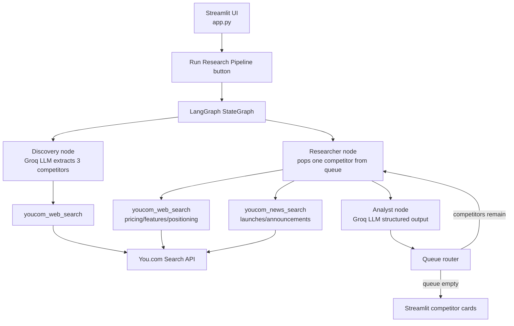

# Market research agent

A Streamlit application built around a cyclic LangGraph orchestrator. It discovers up to three competitors for a given company, researches each competitor one at a time using You.com web and news search, and uses a Groq-hosted LLM to turn the raw evidence into a structured competitor report.

The current build requires both a Groq API key and a You.com API key. If either is missing, the app shows an error and does not run the pipeline; if the LLM call fails for a step, that step falls back to a fixed offline report so the run still completes.

## Architecture



## Runtime flow

1. The user enters a company or product name in the Streamlit form and clicks **Run Research Pipeline**.
2. The app checks that `GROQ_API_KEY` and `YOUCOM_API_KEY` are both set before starting.
3. The discovery node asks the Groq LLM to extract exactly three named competitors from a You.com web search.
4. The researcher node pops one competitor off the queue and runs a web search and a news search for it via You.com.
5. The analyst node asks the Groq LLM to turn that raw evidence into a structured `CompetitorReport` (pricing, features, positioning, recent news); if the LLM call fails, a fixed fallback report is used instead so the run still completes.
6. The queue router sends the graph back to the researcher node until the competitor queue is empty, then ends the run.
7. Streamlit renders one expandable card per competitor with pricing, market position, core features, and recent news.

## Project layout

```text
MARKET_RESEARCH_AGENT/
├── app.py                     # Streamlit entrypoint: LangGraph pipeline, Groq nodes, report cards
├── youcom_client.py           # You.com Search API client (requires YOUCOM_API_KEY)
├── youcom_tools.py            # LangChain tools (youcom_web_search/news_search) and legacy MarketResearchWorkflow
├── langgraph_workflow.py      # Older queue-based LangGraph flow (schemas/security-based), retained for compatibility
├── graph.py                   # Older typed pipeline retained for compatibility
├── streamlit_app.py           # Older Streamlit entrypoint retained for compatibility
├── schemas.py                 # Dataclass contracts used by the legacy workflow
├── security.py                # Input validation and text sanitization used by the legacy workflow
├── test_architecture.py       # Contract and typed-pipeline tests
├── test_market_agent.py       # Client/tool compatibility tests
├── generate_design_doc.py     # Generates the .docx design/architecture documents
├── requirements.txt           # Runtime and test dependencies
├── .env.example                # Safe API-key configuration template
└── .env                        # Local secrets; not committed (see .gitignore)
```

`app.py` is the active entrypoint. `langgraph_workflow.py`, `graph.py`, and `streamlit_app.py` are earlier iterations of the same idea kept around for reference and their existing tests.

## Configuration

Copy `.env.example` to `.env` and fill in real keys:

```powershell
Copy-Item .env.example .env
```

Then edit `.env`:

```env
GROQ_MODEL=openai/gpt-oss-120b
GROQ_API_KEY=your_real_groq_api_key
YOUCOM_API_KEY=your_real_youcom_api_key
```

- `GROQ_API_KEY` — required to run discovery and analysis with an LLM.
- `GROQ_MODEL` — optional, defaults to `llama-3.3-70b-versatile` if unset.
- `YOUCOM_API_KEY` — required for web and news search; the client raises an error at startup if it's missing.

Neither key is ever printed by the app. `.env` is excluded from version control via `.gitignore`.

## Setup and usage

Create and activate the virtual environment:

```powershell
python -m venv .venv
.venv\Scripts\Activate.ps1
```

Install dependencies:

```powershell
pip install -r requirements.txt
```

Start the app:

```powershell
streamlit run app.py
```

Open [http://localhost:8501](http://localhost:8501), enter a company or product name such as `Anthropic Claude`, and click **Run Research Pipeline**.

## Reports and evidence

Each competitor card shows:

- competitor name
- pricing model
- core features (3-5)
- market positioning
- recent news

If the Groq structured-output call fails for a competitor, the analyst node falls back to a fixed offline report for that competitor so the pipeline still completes end to end.

## Testing

Run all tests from the project root:

```powershell
python -m pytest -q
```

Compile the main modules:

```powershell
python -m py_compile app.py youcom_client.py youcom_tools.py
```

Note: some tests in `test_market_agent.py` (offline fixture behavior for `YouComClient`) were written against an earlier version of `youcom_client.py` that returned local fixtures when no API key was set; the current client raises an error instead, so those specific assertions no longer apply.

## Security and limitations

- Keep `.env` private and never commit real API keys.
- Company names are used directly in search queries and LLM prompts; no separate sanitization layer runs in the current `app.py` flow.
- Search results and inferred positioning should be reviewed by a person.
- The You.com client uses a single search endpoint and does not crawl full competitor pages.
- The app requires both API keys to run; there is no fully offline mode in the current build.
